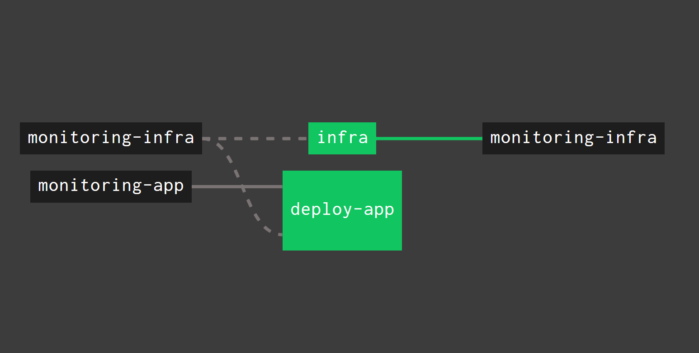
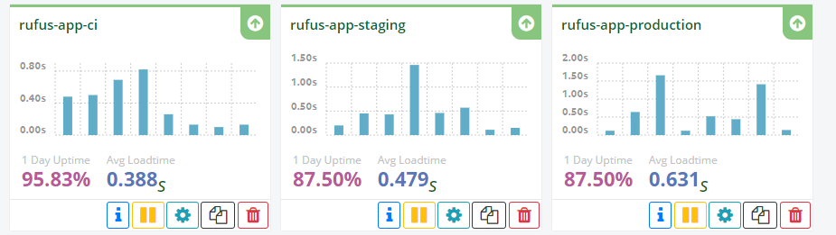

# PGR301 DevOps Exam

### Table of contents

- [Technologies](#technologies)
- [Tasks done](#tasks-done)
- [Setup](#setup)
- [Application and base pipeline](#application-and-base-pipeline)
  * [Infrastructure](#infrastructure)
- [Metrics](#metrics)
- [Docker](#docker)
- [Devops Theory](#devops-theory)
  * [III Config](#iii-config)
  * [X Dev/prod parity](#x-dev-prod-parity)
  * [XI Logs](#xi-logs)
- [Known issues](#known-issues)
- [Exam](#exam)
- [References](#references)

### Technologies
- [Docker](https://www.docker.com/)
- [Concourse CI](https://concourse-ci.org/)
- [Terraform](https://www.terraform.io/)

### Tasks done
- [x] Application and base pipeline (20 points)
- [x] Metrics (20 points)
- [x] Docker (10 points)
- [x] DevOps Theory (10 points)

### Setup
- Create an account on following websites
    - [Github](https://github.com/)
    - [Heroku](https://www.heroku.com/)
    - [StatusCake](https://www.statuscake.com/)
    
- Install [Docker](https://www.docker.com/)
    
- Fork these repositories
    - [Infrastructure](https://github.com/athenus-rufus/exam-infra)
    - [Application](https://github.com/athenus-rufus/exam-app)
        
- Make deploy keys for app and infra
    - `ssh-keygen -t rsa -f ~/.ssh/key_name -C "example@example.com"`
    - `eval $(ssh-agent -s)`
    - `ssh-add ~/.ssh/key_name`
    - `clip < ~/.ssh/key_name.pub`
    -  Use *.pub public keys when creating deploy keys for github repos. Keys should have write access.
    - `clip < ~/.ssh/key_name` (save this for credentials step)
    
- Credentials
    - Rename `credentials_example.yml` to `credentials.yml` and replace the following values:
        - `deploy_key_infra` value with previously copied infra key 
        - `deploy_key_app` value with previously copied app key 
        - `heroku_email` with your Heroku email
        - `heroku_api_key` with your Heroku API key, found in [heroku dashboard](https://dashboard.heroku.com/account)
        - `github_token` with your Github token
            - Guide to creating a github [personal access token](https://help.github.com/en/articles/creating-a-personal-access-token-for-the-command-line)
        - `heroku_app_name` same as app-prefix value from terraform variables
        - `statuscake_api_key` with your StatusCake API key found in [statuscake dashboard](https://app.statuscake.com/User.php)

- Terraform variables
    - `terraform/variables.tf` modify "app_prefix" and "pipeline_name"
    - `terraform/provider_heroku.tf` replace with your Heroku email
    - `terraform/statuscake.tf` replace with your StatusCake username
    
- Pipeline
    - Replace github resources with your forked repos uri's

- If running for the first time, delete terraform.tfstate file

### Application and base pipeline

  
- Run following commands:
    - `docker-compose up -d` to start a [Concourse container](https://raw.githubusercontent.com/starkandwayne/concourse-tutorial/master/docker-compose.yml)
    - `fly -t devops login` to login
    - `fly -t devops sp -p exam-pipeline -c concourse/pipeline.yml -l credentials.yml` to set pipeline
    - `fly -t devops up -p exam-pipeline` to unpause pipeline
- Go to `http://127.0.0.1:8080/teams/main/pipelines/exam-pipeline` and run infra job
    - When infra job is finished, either start build job manually, or make a commit to the app repo to trigger the build
    - Wait for build to finish, and open the ci app in Heroku

#### Infrastructure    
- The application is hosted on Heroku in 3 environments: CI, Staging and Production
- Environments have the same infrastructure (Environment Parity)
- Deployment from the CI environment to Stage and production can be done manually by promoting the application in the Heroku dashboard
- Each environment has an uptime test on StatusCake

### Metrics 

| Type          | Name                 | Endpoint    |     
|:-------------:| ---------------------|:------------------------------------:|
| Meter         | books                | `POST` `GET` `/books`                   |
| Meter         | books                | `GET` `PUT` `PATCH` `DELETE` `/books/{id}`| 
| Meter         | books                | `GET` `/books/name/{name}`             | 
| Meter         | books                | `PATCH` `/books/{id}/price`            | 
| Counter       | greeting             | `GET` `/`                              |
| Counter       | books available      | `POST` `DELETE` `/books`                | 
| Histogram     | books price change   | `PATCH` `/books/{id}/price`            | 
| Histogram     | request body length  | `PATCH` `/books/{id}`                  | 
| Gauge         | books count          | `DELETE` `/books/{id}`                 | 
| Timer         | merge patch book     | `PATCH` `/books/{id}`                  | 

### Docker 

From app's root directory:
- Run `mvn clean install`
- Build an image `docker build --build-arg JAR_FILE=target/book-1.0-SNAPSHOT.jar .`
- Run image as container `docker run -p 4000:8081 <image id>`

### Devops Theory

#### III Config
- An application's config is everything that is likely to change between deploys
- Twelve-factor app requires strict separation of config from code
- Storing configs as constants in the code is a violation of twelve-factor app
- Config can be stored in environment variables, or externalised into other tools:
    - Consul for dynamic configuration
    - Vault for secrets management
- Example: Heroku allows to store config in config-vars, which are exposed to application at runtime

#### X Dev/prod parity
- The purpose of this factor is to keep development, staging, and production environments as similar as possible
- By doing this, we are ensuring that following gaps are minimised:
    - Time between deploys
    - Personnel gap
    - Tools gap 
- Using the same Terraform configuration to provision identical dev, staging and production environments ensures environment parity
- Example: 
    - The [Application](https://github.com/athenus-rufus/exam-app) is hosted in 3 environments on Heroku
    - Each environment has the same infrastructure

#### XI Logs 
- Logs provide visibility into the behavior of a running app
- They can be used to find specific event, for graphing of trends and alerting when an error occurs
- During local development, log stream can be displayed in the terminal
- In staging or production, streams can be sent to a log analysis system
- Example: 
    - Integration of Metrics library from Dropwizard. Following metrics have been demonstrated:
        - Meter: measure the rate of requests to `/book` endpoint, in requests per second
        - Counter: measure books available on `POST` (increment) and `DELETE` (decrement) to `/book` endpoint
        - Histogram: measure changes of  books price on `PATCH` to `/books/{id}/price` endpoint
        - Gauge: measure the count of all books on `DELETE` to `/book` endpoint
        - Timer: measure the amount of time it takes to process `PATCH` request to `/books/{id}`

### Known issues
    
- If `Backend error: Exit status: 500... permission denied` occurs, make sure to run `git update-index --chmod=+x file.sh` for all .sh files

### Exam
Exam can be found [here](exam/exam.md)

### References
- [The Twelve-Factor App](https://12factor.net/)

    
    

